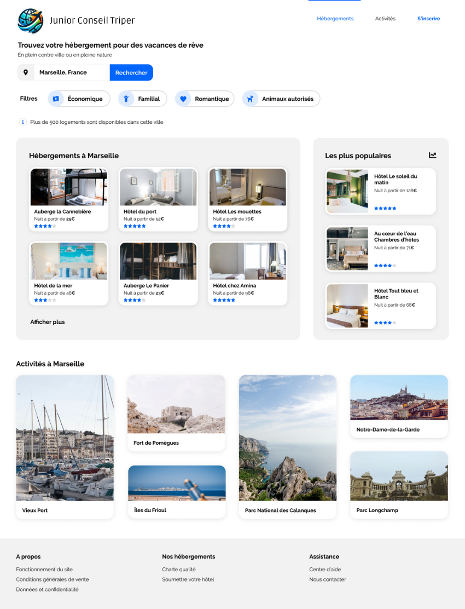
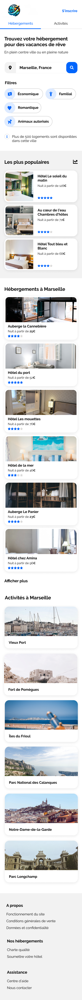

# Junior Conseil Triper ✈️

Voici mon premier projet à la Taker Acedemy !

L'objectif de la Taker Academy est de me former au developpement web à travers plusieurs projets qui aborderont les différents aspects du web !

Et pour ce premier projet, quoi de mieux que de commencer par un projet emblématique du web : la recréation de maquette !

## Objectif du projet 🎯

- Comprendre les bases de l'HTML et du CSS
- Comprendre les principes de base du responsive design
- Comprendre les principes de base du SEO et de la sémantique

## Instructions 📚

Voilà le topo :

Junior Conseil Triper a racheté Reservia et a malheureusement perdu l'intégralité de la base de code !

L'objectif principal est de recréer from scratch en ``HTML/CSS`` cette maquette :

Bien évidemment, le site doit être responsive. Voici la maquette mobile :

## Hâte de passer au prochain projet ! 💪
